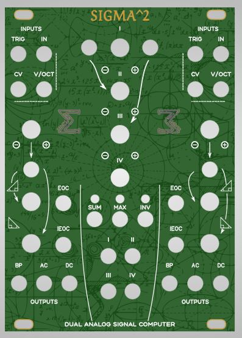
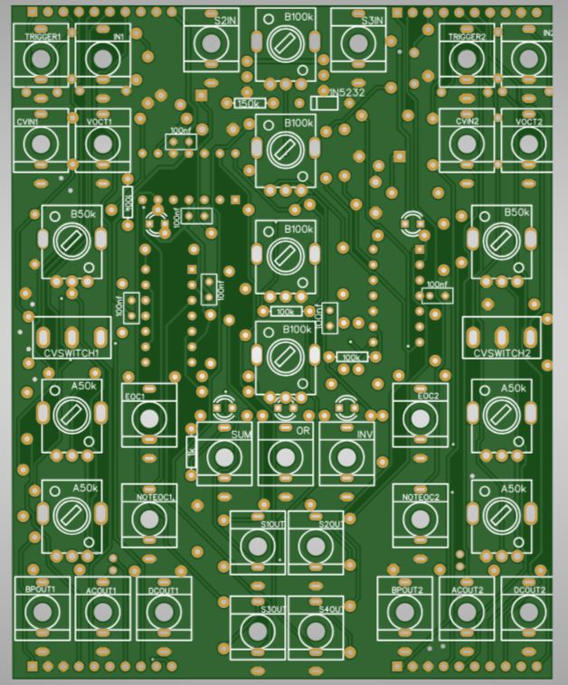
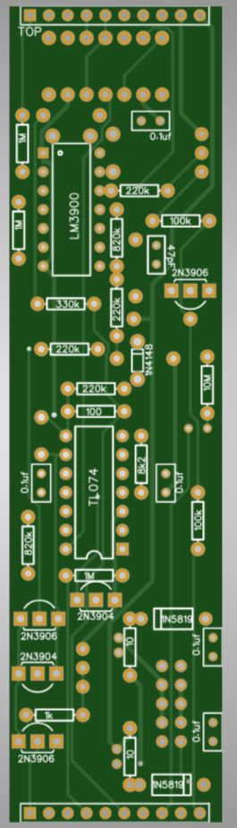

# Sigma and Sigma² Euroack Modules

Sigma² is a shameless through hole ripoff of the popular Make Noise Maths eurorack module 
on the basis of voxmachina sigma. This repository includes the files for a slimmer version of 
voxmachina sigma, as well as sigma².

  

## Disclaimer
This project is not involved with make noise. 
In fact, to make sure I am not breaching intellectual 
property with this, I tried to look into make noise's documentation as little as possible.
I do not own a maths and I tried to reverse engineer the functionality more or less only based on
youtube tutorials for maths. 
Sigma is made by voxmachina (musicdevghost on github) who gave me the permission to use his designs
under MIT license. Sigma and Maths are both based on a pretty old design, the serge VCS.

## Status
this works, I have built both sigma and sigma², both of my units work fine-ish.
The "volt per octave" tuning could be improved and I am open to suggestions.
The build is very challenging (definitely the biggest through-hole build I have ever done)
and the PCB is annoying to build with lots of parts tightly together, but it is the best I could
do without increasing HP or using smd parts. 
TODO:
- think about easier build
- better v/oct tracking

## What is what
One of my design goals was that since Maths is effectively 2 serge vcs with a mixing and 
max and comparator section in the middle, why not make sigma² basically just 2 sigmas with 
an extra secion in the middle. So basically sigma has a control pcb and a main pcb, and now
sigma squared has two sigma main pcbs and the extra circuitry on a larger control pcb.
The main pcbs are interchangeable, so the units are somewhat modular.

## BOMs and ordering
Due to the way I set up the project, sadly BOMs are separated for each pcb.

Meaning: If you want to build Sigma, you need:
- 1x sigma control pcb
- 1x sigma main pcb
- 1x sigma panel pcb
- 1x parts from sigma control BOM
- 1x parts from sigma main BOM

If you want to build sigma^2, you need:
- 2x sigma main pcb
- 1x sigma² control pcb
- 1x sigma² panel pcb
- 2x parts from sigma main BOM
- 1x parts from sigma² control BOM

Github user @K-Teck-Dave let me know that if you have trouble sourcing A50k pots or have B50k lying around those will work fine instead too :)
If you have a hard time sourcing the 1N5232 Zener diode any 5.6V zener should work.

# Build process

Main pcb is relatively easy and straight forward.
Control pcb sadly is has a few tight places that are not fun to solder.
Take care with the resistors that are between the jacks specifically.
Since I was asked the print on the LED footprint sadly is not that clear. 
**All LEDs face left when viewing the panel. Anode (round part) left, Cathode right.**

## Tuning the trimpots

There are several trimpots on the module. The ones on sigma main pcb relate to volt per octave tracking.
For these, refer to [voxmachina's video](https://www.youtube.com/watch?v=iQzIH3weC9s) but beware that
it is not likely to track more than 2 octaves either way.
The two trimpots on the main pcb set voltage for channel 2 and 3.
On maths these are normalled (when no input is given) to 10v and 5v, on sigma squared you can
adjust them from 0-12V using the trimpot. measure the middle leg against the ground leg to
tune the setting to your liking.

